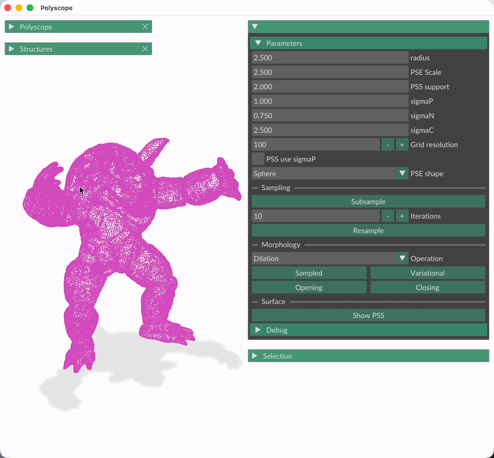

# Point Morphology

Point cloud morphology: dilation, erosion, opening, and closing operations performed directly on point sets, without building a mesh or a full Minkowski-sum representation. 

A full write-up with the math and results lives [here](https://leonardeyer.github.io/Point-Morphology)

<table>
  <tr>
    <td></td>
    <td></td>
    <td></td>
    <td></td>
  </tr>
  <tr>
      <td>Dilation: cube</td>
      <td>Erosion: sphere</td>
      <td>Opening: cube</td>
      <td>Dilation: hand</td>
  </tr>
</table>

## Features

- Dilation, erosion, opening, and closing on raw point clouds
- Spherical, cube and custom/self structuring elements
- Morpho-adaptive resampling (importance-weighted subsampling + resampling)
- Interactive GUI viewer
- PLY and NOFF input formats

## Requirements

Built and tested with:
- CMake 4.3.0
- Apple Clang 21.0.0

## Building

```bash
cmake -B build -S . -GNinja -DCMAKE_BUILD_TYPE=Release
cmake --build build
```

## Usage
Interactive GUI mode, just supply a point cloud:
```bash
./build/point-morphology -[noff/ply] [path-to-file]
```
For performance and the quality of the PSS representation it is advised to make use of initial sub- and resampling of the input mesh.

<p align="center">
  
</p>
