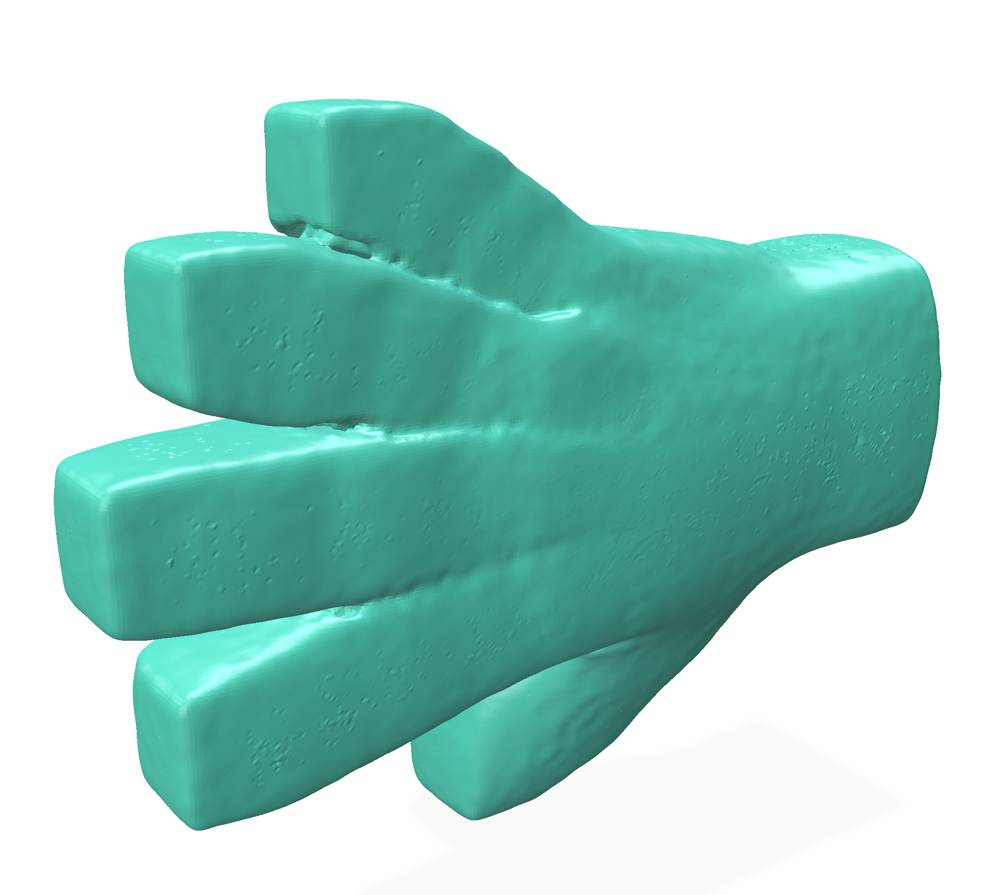
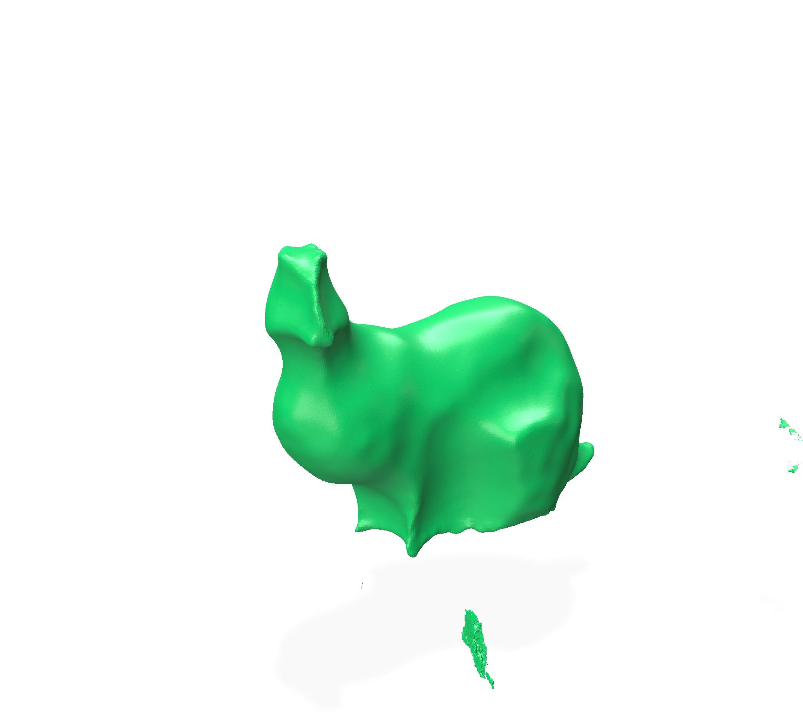
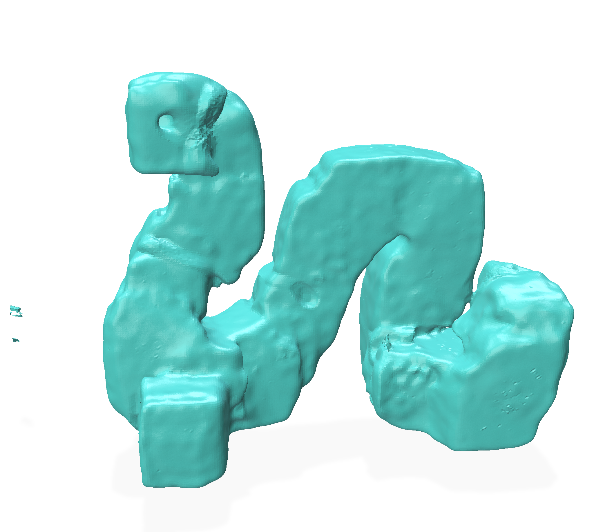
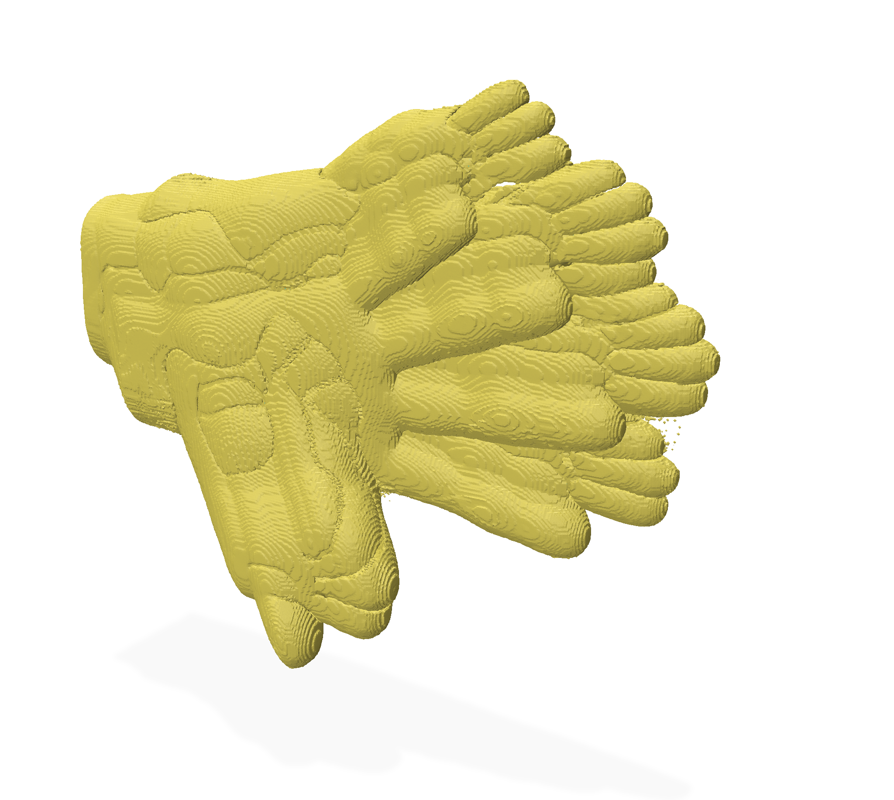

# Point Morphology

Point cloud morphology: dilation, erosion, opening, and closing operations performed directly on point sets, without building a mesh or a full Minkowski-sum representation.

This implements the method from Calderon & Boubekeur's *Point Morphology*. A full write-up with the math and results is here: https://leonardeyer.github.io/Point-Morphology/

<table>
  <tr>
    <td></td>
    <td></td>
    <td></td>
    <td></td>
  </tr>
  <tr>
      <td>Dilation: cube</td>
      <td>Erosion: sphere</td>
      <td>Opening: cube</td>
      <td>Dilation: hand</td>
  </tr>
</table>

## Features

- Dilation, erosion, opening, and closing on raw point clouds
- Spherical, cube and custom/self structuring elements
- Morpho-adaptive resampling (importance-weighted subsampling + resampling)
- Interactive GUI viewer
- PLY and NOFF input formats

## Requirements

Built and tested with:
- CMake 4.3.0
- Apple Clang 21.0.0

## Building

```bash
cmake -B build -S . -GNinja -DCMAKE_BUILD_TYPE=Release
cmake --build build
```

## Usage

Interactive GUI mode, just supply a point cloud:

```bash
./build/point-morphology -[noff/ply] [path-to-file]
```
## Recommended Workflow
Start the GUI buy supplying the standford bunny:
```bash
./build/point-morphology -ply resources/bunny.ply
```

### Parameters

| Parameter | Role | Suggested value |
|---|---|---|
| `sigma` | Support size of the MLS weighting kernel; scale at which the surface fit is done | Set to the kernel support of the input surface |
| `sigma_p` | Width of the positional kernel in the sampling embedding; controls output point spacing | `sigma_p = min(sigma, s) / 2`, where `s` is the PSE's minimum local feature size |
| `sigma_c` | Width of the kernel comparing fitted centroids | `sigma_c = s` |

Parameter guidance is approximate; for openings and closings especially, intermediate results are sensitive to noise in the surface fit and may need manual tuning.
